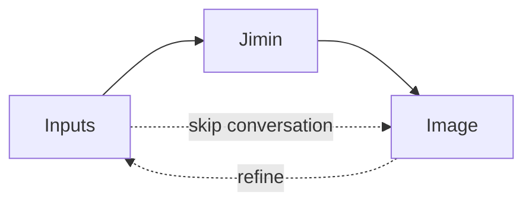

# Jimin

A concept visualizer for architects.

You give her an idea — a sketch, a reference image, a paragraph of intent — 
and she renders it as an architectural concept image.

Built around the idea that an architect's first instinct deserves a fast 
visual reply.

## What Jimin does

Existing rendering tools — V-Ray, Enscape, Lumion, Twinmotion — turn 
**finished models** into **final images**. They need full geometry, materials 
assigned, lighting set. They render *after* the design is resolved.

Jimin works upstream of all of them. She turns a **rough viewport export** 
into a real rendered image, guided by a reference and your spoken intent. 
She works in the gap between "I have an idea" and "I've modeled it" — the 
phase that today belongs to hand sketching.

A few things make her useful:

- **She renders in any style.** Photorealistic photograph, graphite 
  illustration, watercolor sketch, dusk render — the style is determined 
  by the reference image you give her, not by what she does. Point her at 
  a photo, get a photo. Point her at an illustration, get an illustration.

- **She renders fast.** Draft renders complete in seconds. The iteration 
  loop is conversational — you adjust the prompt and re-render, the way 
  you'd flip through sketches.

- **She doesn't replace your existing pipeline.** Lumion still does Lumion 
  things. V-Ray still does V-Ray things. Jimin sits earlier in the design 
  process and feeds the result to whatever comes next.

## How it works

You provide the inputs (a viewport export of your massing, a reference image 
for the aesthetic, optionally a prompt). The default path goes through 
conversation — Jimin holds context, helps shape your intent, then triggers 
the render. If you want a quick result without conversation, you can skip 
straight to the image. Either way, the loop continues — refine the inputs 
or the conversation, render again.

## Download

Latest builds live under [Releases](https://github.com/KunKun1226/Jimin/releases).

Currently a Windows desktop app. Mac and public builds will arrive when 
they're ready.

## Requirements

| What | Why | Where to get it |
|---|---|---|
| Windows 10 or 11 | The .msi installer is Windows-only for now | — |
| Anthropic API key | Powers Jimin's conversation and the prompt writer | [console.anthropic.com](https://console.anthropic.com) |
| Google AI Studio API key | Powers the image generation | [aistudio.google.com](https://aistudio.google.com) |

You provide the keys; the app uses them to make calls on your behalf. Keys 
stay on your machine — Jimin doesn't proxy through any server.

## Status

In active development. Source available; private builds shared with friends 
while the work is still in development.

Thanks
